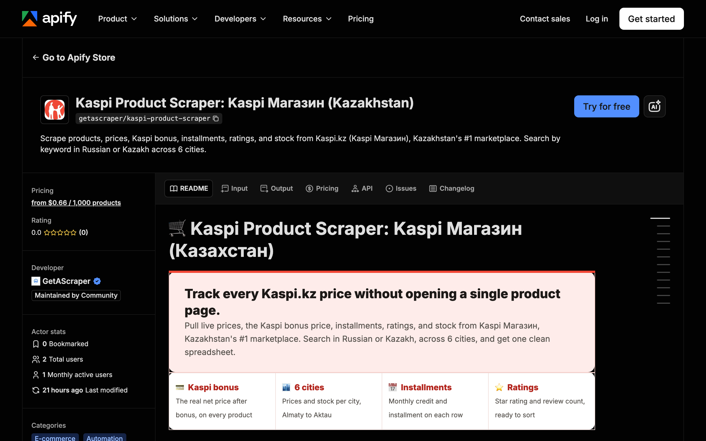

<div align="center">

# Kaspi Product Scraper: Kaspi.kz Products

[](https://apify.com/getascraper/kaspi-product-scraper)
[](https://apify.com/getascraper/kaspi-product-scraper)
[](https://apify.com/getascraper/kaspi-product-scraper)
[](https://github.com/getascraper/how-to-scrape-kaspi/issues)
[](https://github.com/getascraper/how-to-scrape-kaspi/commits/main)

Scrape products, prices, Kaspi bonus, installments, ratings, and stock from Kaspi.kz, Kazakhstan's leading marketplace. Search by keyword in Russian or Kazakh across 6 cities.

[](https://apify.com/getascraper/kaspi-product-scraper)

</div>

---

## Why use Kaspi Product Scraper

* **Real Kaspi bonus pricing**: Every row includes the price after Kaspi bonus, not just the sticker price.
* **City-level accuracy**: Prices, stock, and delivery speed change by city, so you pick the city and get numbers that match it.
* **Installment and credit terms**: See the monthly installment and credit price buyers actually compare against.
* **Search in your own language**: Type keywords in Russian or Kazakh and get matching results back.
* **Clean spreadsheet output**: Every product is a flat row, ready for Excel, CSV, JSON, or a Google Sheet.

---

## How to use Kaspi Product Scraper

1. Add your search keywords in Russian or Kazakh, or paste direct Kaspi search URLs.
2. Pick a city so prices, Kaspi bonus, and stock match the market you care about.
3. Click **Start**: The actor collects every matching record and writes one flat row per item.
4. **Download your results**: Export as Excel, CSV, JSON, or HTML from the Output tab.

---

## Input

| Field | Type | Required | Description |
| --- | --- | :---: | --- |
| `searchQueries` | array of text | No | Keywords to search on Kaspi.kz, in Russian or Kazakh, e.g. "iphone", "холодильник". |
| `startUrls` | array of URLs | No | Direct Kaspi search URLs, e.g. https://kaspi.kz/shop/search/?text=iphone. |
| `city` | enum | No | City for prices, Kaspi bonus, stock, and delivery: Almaty, Astana, Shymkent, Karaganda, Aktobe, or Aktau. |
| `maxItems` | integer | No | Maximum total product rows returned. 0 means unlimited. |
| `maxPagesPerQuery` | integer | No | Result pages per keyword. Kaspi returns up to 24 top products per keyword. |
| `proxyConfiguration` | object | No | Proxy settings. The default works reliably for Kaspi. |

---

## Output

Each row in your dataset is one product. All fields are flat with no nested data, so the file opens cleanly in any spreadsheet program.

```json
{
  "productId": "145467625",
  "title": "Apple iPhone 17 Pro 256Gb NanoSIM+eSIM оранжевый",
  "brand": "Apple",
  "url": "https://kaspi.kz/p/apple-iphone-17-pro-256gb-nanosim-esim-oranzhevyi-145467625/?c=750000000",
  "price": 786499,
  "priceWithBonus": 762905,
  "creditMonthlyPrice": 32771,
  "monthlyInstallment": "32 771 ₸",
  "rating": 4.9,
  "reviewsQuantity": 1762,
  "inStock": true,
  "stockCount": 1,
  "deliveryDuration": "TODAY",
  "category": ["Телефоны и гаджеты", "Смартфоны"],
  "image": "https://resources.cdn-kaspi.kz/img/m/p/p18/p96/64168413.png",
  "cityName": "Алматы",
  "currency": "KZT",
  "scrapedAt": "2026-07-08T00:02:24.004Z"
}
```

### Data table

| Field | Type | Description |
| --- | :---: | --- |
| `productId` | string | Kaspi product ID. |
| `title` | string | Product name. |
| `brand` | string | Product brand. |
| `url` | string | Link to the product page. |
| `price` | number | Current price in tenge. |
| `priceWithBonus` | number | Price after Kaspi bonus deduction. |
| `creditMonthlyPrice` | number | Monthly credit payment. |
| `monthlyInstallment` | string | Monthly installment amount. |
| `rating` | number | Average customer rating. |
| `reviewsQuantity` | number | Number of customer reviews. |
| `inStock` | boolean | Whether the product is available. |
| `stockCount` | number | Units in stock. |
| `deliveryDuration` | string | Delivery speed, e.g. TODAY or TOMORROW. |
| `category` | array of text | Category path. |
| `image` | string | Main product image URL. |
| `cityName` | string | City the prices apply to. |
| `currency` | string | Price currency (KZT). |
| `scrapedAt` | string | Timestamp of when the row was collected. |

---

## Pricing

**$0.00088 per product row, about $0.88 per 1,000 results.** No monthly subscriptions and no minimum commits. New Apify accounts include $5 of free usage, so you can try it before you pay.

You only pay for the products you collect. A typical run of 100 products completes in under a minute.

---

## Quick start

Create a `.env` file from `.env.example`, add your [Apify API token](https://console.apify.com/account/integrations), and run:

```bash
npm install
npm start
```

The script uses the [Apify API client](https://docs.apify.com/api/client/js/) to start [Kaspi Product Scraper](https://apify.com/getascraper/kaspi-product-scraper) and fetch results.

---

## Tips and optimization

* **Use specific keywords**: Kaspi returns up to 24 top-relevance products per keyword, so several specific terms beat one broad search.
* **Compare across cities**: Prices, Kaspi bonus, and stock differ by city, so run the same keywords across cities to compare.
* **Search in your own language**: Use Russian or Kazakh, whichever matches how you think about the product.
* **Schedule for price history**: Schedule the actor in Apify to build a running price history without touching a spreadsheet.

---

## FAQ

**How many products can it return per keyword?**
Kaspi serves up to 24 top-relevance products per keyword. To collect more, add more specific keywords or run the same term across several cities.

**Do I need a Kaspi account?**
No. The actor reads only public product and price data. No login or account required.

**Can I search in Kazakh?**
Yes. Search keywords work in both Kazakh and Russian, and results include Russian product names and categories.

**Is it legal to scrape Kaspi.kz?**
The actor collects publicly available product and pricing data that Kaspi already displays on its own pages. You are responsible for following Kaspi's terms of service and any applicable data protection laws in your jurisdiction.

---

## Support

For bug reports, missing fields, or feature requests, open an issue under the [Issues](https://github.com/getascraper/how-to-scrape-kaspi/issues) tab.
